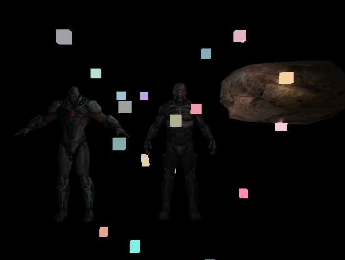

# Computer graphics tasks

## Сборка
1. cmake CMakeLists.txt
2. make

Перемещение камеры: W, A, S, D

## Задача №2 `bin/task2`

## Задача №3 `bin/task3`

Переключение режимов фильтрации: 1, 2, 3

Установить проектор: SPACE

Переключение режимов: С

## Задача №4 `bin/task4`

